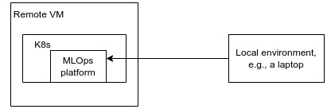
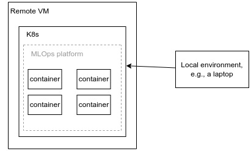
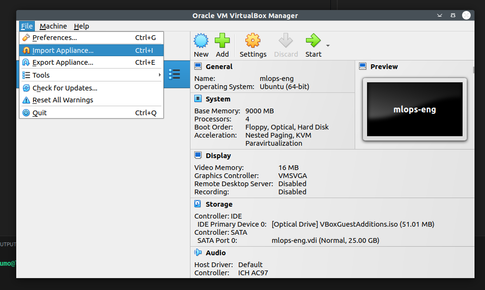
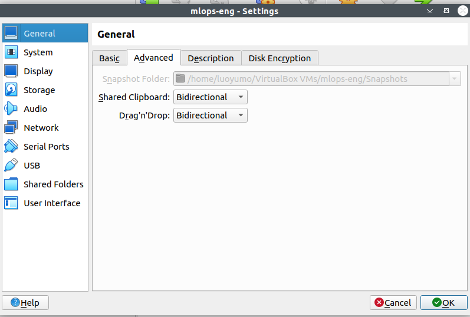
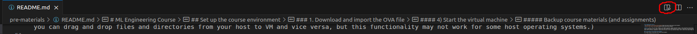
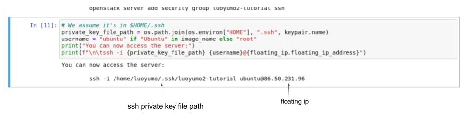
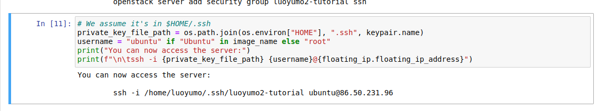
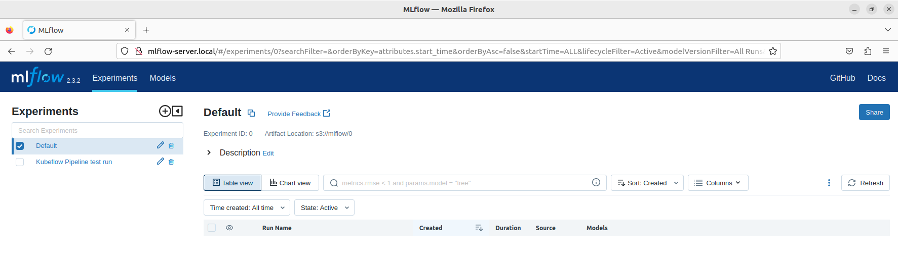

# ML Engineering Course
* [An overview of the course environment](#an-overview-of-the-course-environment)
* [Set up the course environment](#set-up-the-course-environment)

**Note**: You'll see two terms "MLOps" and "MLOps platform" appear multiple times in the following instructions. MLOps stands for machine learning operations. From a high level, it's a set of practices that streamline the processes of training, deploying, and monitoring models. MLOps platform is a software platform that offer different components (tools and services) to let you practice MLOps. You'll learn more about MLOps as the course progresses.

## An overview of the course environment
The figure below illustrates the course environment:



From a high level, the course environment consists of two parts:
1) An MLOps platform deployed to a Kubernetes cluster running in a remote virtual machine (VM).
2) A local environment with necessary packages installed for communicating with the remote MLOps platform.

First, let's take a glance at Kubernetes, or shortly, K8s (as there are 8 characters between "K" and "s"). K8s is a commonly used technique to deploy and manage containers. If the concept of container is new, you can see it as a "lightweight VM" that contains everything to run an application, including the code, libraries, dependencies, and runtime environment. If we go back to the above figure of the course environment, the MLOps platform actually consists of multiple containers:



There are two reasons for using this environment in the course:
1) Some of the MLOps platform components are K8s-based. In other words, a K8s cluster is needed to host some services/tools you will use in this course. A K8s cluster is memory demanding. By using a remote virtual machine to run it, you don't need to worry about the memory limitation of your own computer.  
2) This environment can simulate real-world working conditions where a remote platform with extensive computational resources is used to train and deploy  ML models, rather than running everything solely on a local machine with limited memory and CPU/GPU resources.


## Set up the course environment
**Warning**: It may take up to a few hours to finish the environment setup, so remember to reserve enough time for this part. 

The instructions below guide you how to set up the course environment. The instructions are based on Linux operating system. We provide a Ubuntu 22.04 LTS OVA file which can be imported as a virtual machine so that you can use the virtual machine as your local environment. We highly recommend using the OVA file as 1) it can mitigate the potential problems caused by different operating systems and 2) the OVA file has the tools required in the course pre-installed. (Of course using the OVA file is not strictly necessary, you can also set up the local environment in your host system if you are familiar with the command lines of Linux and your operating system and ready for debugging issues caused by different operating systems).

If you opt to use the OVA file, follow the "[Download and import the OVA file](#1-download-and-import-the-ova-file)" instructions below. Otherwise follow the [preparation instructions](./docs/preparation_without_vm.md) and then jump to the "[Create a VM in cPouta](#2-create-a-vm-in-cpouta)" part. 

### 1. Download and import the OVA file
#### 1) Download VirtualBox
VirtualBox can be downloaded from [the official website](https://www.virtualbox.org/wiki/Downloads). Version 7 is recommended.

#### 2) Download the OVA file
The OVA file can be downloaded through the link provided in Moodle.

#### 3) Import the OVA file in VirtualBox
1. Open VirtualBox
2. Click File -> Import Appliance



3. Select the downloaded OVA file, click Next -> Finish

#### 4) Start the virtual machine
After importing the OVA file, you will see a VM created. 

Let's first enable bidirectional shared clipboard so you can copy/paste text from your host to VM (and vice versa). You can do this by going to VirtualBox Manager control panel -> clicking Settings -> General -> Advanced -> setting Shared Clipboard to bidirectional. (You can also set Drag'n'Drop to bidirectional so you can drag and drop files and directories from your host to VM and vice versa, but this functionality may not work for some host operating systems.)



Now, you can log in to your VM. The username is "**user**" and the password for login and admin privilege is "**password**". After logging in, you'll see a `engineering_of_ml_systems` directory, inside which you can see a `pre_materials` directory.

*Note*: the default keyboard layout of the VM is Finnish, you can configure the keyboard layouts following [this article](https://help.ubuntu.com/stable/ubuntu-help/keyboard-layouts.html.en).

---

#### Backup course materials (Optional)
It's a good practice a back up the course materials you'll be working on so you won't loss them (especially your work-in-progress assignments) when your VM crashes. Note that your modifications on the files in your VM won't be synchronized to your host so you need to take care of the backup, e.g., using GitHub or some other cloud services like OneDrive or Google Drive. Alternatively, you can also back up the whole virtual machine by creating an OVA file for it, as shown in this [video](https://www.youtube.com/watch?v=9qSTS-RgOA0).

---

In your VM, open a terminal (ctrl+alt+t) and run the following command to switch to the correct Python environment:
```bash
conda activate mlops_eng
```

And go to the `engineering_of_ml_systems/pre-materials` directory:
```bash
cd ~/Desktop/engineering_of_ml_systems/pre-materials
```

You can use Visual Studio Code (VS Code) to open the directory:
```bash
code .
```
Open the `README.md` and you'll see the same instructions. You can open a preview of a Markdown file by clicking the button shown below in the upper-right corner.



### 2. Create a VM in cPouta
Now, it is time to start set up the remote MLOps platform. In the instructions below, you will need to run some commands in a terminal. You should run them in your local environment unless separately specified.

**Note**: If you are using the Ubuntu VM in VirtualBox, then the **VM running in VirtualBox (not your host system)** is your local environment. 

In this instruction, you will need to run a Jupyter notebook and commands in a terminal. Using VS Code will make it easier as you can open a terminal in the same VS Code window (Terminal -> New Terminal in the navigation bar) to avoid switching between VS Code and a terminal. 

Go to the setup directory
```bash
cd setup
```
Then follow the instructions in [1_create_vm/openstack.ipynb](./setup/1_create_vm/openstack.ipynb) to launch a VM in cPouta, the IaaS cloud service at CSC (Finnish IT center for science).


### 3. Install necessary tools and create a K8s cluster in the cPouta VM
**Note**: In this and and next part, you'll need to run some scripts in your local environment and the remote cPouta VM. In case you get an error when running the scripts, please first check if your issue is covered [here](./docs/Q&A.md#setting-up-the-mlops-platform-in-cpouta). If not, please pose your issue in the Moodle forum. 

You will use some Ansible scripts to create a K8s cluster in your VM. Simply speaking, Ansible is a tool for running commands/scripts in remote machines from your local machine. 

First, you need to change some configuration so that Ansible knows how to reach your remote VM.

First, Change the `floating_ip` and `ssh_key_file` variables in the [setup/2_ansible_scripts/inventory.ini file](./setup/2_ansible_scripts/inventory.ini) directory:
```
[openstack_vms]
<floating-ip-of-your-vm> ansible_user=ubuntu ansible_ssh_private_key_file=<the-ssh-private-key-file-for-connecting-to-your-vm>
```
You can find the floating_ip and your ssh key file at the end of [1_create_vm/openstack.ipynb](./setup/1_create_vm/openstack.ipynb):



Then run the Ansible scripts
```bash
# Go to the 2_ansible_scripts directory
cd setup/2_ansible_scripts

# Under the 2_ansible_scripts directory
ansible-playbook -i inventory.ini playbook.yaml -vv
```
>In case you are interested, the Ansible scripts will mainly perform two tasks:
>- Install the necessary packages for creating a K8s cluster and deploying the MLOps platform, e.g., Python3, Docker, and [Kind](https://kind.sigs.K8s.io/).
>- Create a K8s cluster and copy the cluster configuration file of the cluster back to your local machine so that you can access the cluster from your local machine. 

It will take some time to finish the execution of the Ansible scripts. If you see the following output, the Ansible scripts have been successfully completed.
```text
PLAY RECAP *********************************************************************
128.214.252.130            : ok=18   changed=13   unreachable=0    failed=0    skipped=0    rescued=0    ignored=0
```

After running the Ansible scripts, a K8s cluster has been created in your remote cPouta VM. A file named `mlops_config` has been copied to a directory called `.kube` under your home directory in your local machine. This `mlops_config` file includes the information and credentials needed by kubectl (K8s command line tool) to communicate with the K8s cluster. 

Finally, you need to do some configurations so that kubectl in your local environment knows how to access the information and credentials for communicating with your K8s cluster created in your remote cPouta VM.
* Case 1: If you don't have any other K8s cluster running, rename the `mlops_config` file to `config` using the following command. 
```bash
mv ~/.kube/mlops_config ~/.kube/config
```
kubectl will automatically grab the needed credentials from the `config` file.
* Case 2: If you have another K8s cluster running, adjust an environmental variable called `KUBECONFIG` so that kubectl knows that it should access the `mlops_config` file when being executed. 
```bash
# Persist the KUBECONFIG environmental variable
# You only need to run this command once
echo "export KUBECONFIG=~/.kube/mlops_config" >> ~/.bashrc
source ~/.bashrc

# Alternatively, you can mark the variable on the fly, but you need to do this every time you run kubectl in a new terminal session
export KUBECONFIG=~/.kube/mlops_config
```

Make sure kubectl is connecting to the correct cluster
```bash
kubectl config use-context kind-kind-ep
```
Now you should be able to access your K8s cluster from your local machine.
```bash
kubectl get nodes

#You should see one control plane and two worker nodes 
NAME                    STATUS   ROLES           AGE   VERSION
kind-ep-control-plane   Ready    control-plane   16m   v1.24.0
kind-ep-worker          Ready    <none>          16m   v1.24.0
kind-ep-worker2         Ready    <none>          16m   v1.24.0
```
#### Back up K8s cluster credentials (optional)
Similarly to backing up the course materials, we recommend copying the credentials to somewhere else than your VM. This way, you can access your cluster if you lose access to your VM. You can see the content by 
```bash
cat ~/.kube/config
```
### 4. Deploy the MLOps platform
First you need to access your VM:
```bash
# access your VM
ssh -i <your-ssh-key-file> ubuntu@<floating-ip>
```
The command can be copied from the end of 1_create_vm/openstack.ipynb



Then run the following commands in your **remote cPouta VM** (not your local machine)
```bash
cd install_platform
# Install the MLOps platform, it will take ~6min to finish the script
./install.sh
```
If you see the following output, the installation has been completed successfully. 
```text
+ echo Installation 'completed!'
Installation completed!
+ echo
+ exit 0
```

Finally, test that MLOps platform is correctly installed
```bash
# First add ~/.local/bin to PATH as the Python packages used in the testing are installed to ~/.local/bin
export PATH=~/.local/bin:$PATH
./scripts/run_tests.sh
```
If you see the following output, all tests have been passed.
```text
================= 38 passed, 20 warnings in 226.05s (0:03:46) ==================
+ exit 0
```

### 5. Still a bit more configurations in your local environment
#### Configure kubectl to access the correct cluster
In your local environment (not the remote cPouta VM), run the following command to make sure you can access your K8s cluster using kubectl:
```bash
# Check which cluster kubectl accesses
kubectl config current-context

# If the output of the command above is not "kind-kind-ep", configure kubectl to access the correct cluster
kubectl config use-context kind-kind-ep
```
Expected output: Switched to context "kind-kind-ep".

#### Configure /etc/hosts 
As previously mentioned, the MLOps platform you just deployed provides different services that facilitate different phases in MLOps. You'll need to access these services during the course using their host names. To enable your local environment knows how to resolve these host names into IP addresses, you need to modify the `/etc/hosts` file.

If you're using the provided Ubuntu OVA, you can take a look at the /etc/hosts
```bash
cat /etc/hosts
```
You should see some entries like below:
```text
FLOATING_IP mlflow-server.local
FLOATING_IP mlflow-minio.local
...
```
The "mlflow-server.local" and "mlflow-minio.local" are the host names you'll use to access the services provided by your MLOps platform. 

Then run the following command
```bash
export FLOATING_IP=<replace-this-with-the-floating-ip-of-your-cPouta-VM>
sudo sed -i "s/FLOATING_IP/$FLOATING_IP/g" /etc/hosts
```
This command will replace the text "FLOATING_IP" with the real floating IP of your cPouta VM. After doing this, your local environment knows that it should resolve the host names of the services provided by the MLOps platform into the IP of your cPouta VM where the MLOps platform is running. 

If you don't use the provided OVA, you need to manually add the following entries to your own /etc/hosts file (or the corresponding file in Windows).
```text
<floating-IP-of-cPouta-VM> kserve-gateway.local
<floating-IP-of-cPouta-VM> ml-pipeline-ui.local
<floating-IP-of-cPouta-VM> mlflow-server.local
<floating-IP-of-cPouta-VM> mlflow-minio-ui.local
<floating-IP-of-cPouta-VM> mlflow-minio.local
<floating-IP-of-cPouta-VM> prometheus-server.local
<floating-IP-of-cPouta-VM> grafana-server.local
```
Now if you go to [http://mlflow-server.local](http://mlflow-server.local), you should see a Web page similar to the following:



## Wrap up
After following the instructions, you've set up the course environment, You've deployed the MLOps platform to a remote VM in cPouta. You've also configured your local environment so that you can access the remote MLOps platform from your local environment. 

Though the course environment is based on K8s, no prior knowledge of K8s is needed to complete this course. You won't need to deal with K8s in most of the assignments but can directly use the services/tools provided by the MLOps platform. An exception is week4, where you'll need to deploy some models to the K8s cluster. To prepare you for the assiginments of that specific week, we recommend reviewing [this material](./docker_and_k8s/README.md) if containers and K8s are completely new to you. This will help you gain some basic understanding of the concepts of containers and K8s, ensuring smoother learning experience in the course. 

