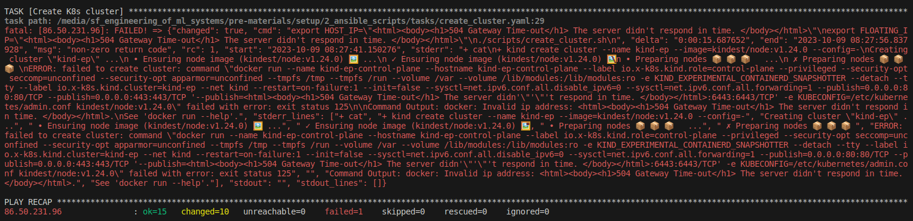

# Possible questions

## Using virtual machines
1. When using the VM in VirtualBox, sometimes I see a reminder of installing some software updates. <br />
You can just ignore th reminder. 

1. My keyboard has a different layout than Finnish keyboard, how can I use an alternative keyboard layout in the VM? <br />
You can follow the instructions in [this article](https://help.ubuntu.com/stable/ubuntu-help/keyboard-layouts.html.en) to configure your keyboard. 

1. I see a warning of a low disk space in the root filesystem. <br />
The VM is assigned ~80GB disk space so there should be enough disk space and this warning is unlikely to appear. If you do see this warning, we recommend first checking if you have anything that occupies a large disk space. If you do need to increase the disk space of your VM, you can follow the instructions in [this blog](https://blog.surges.eu/virtualbox-how-to-solve-the-issue-with-low-disk-space/).

## Setting up the MLOps platform in cPouta
### Running Ansible scripts
1. The Ansible scripts failed to create a K8s cluster in my cPouta VM. What should I do? <br />
Though not very likely, sometimes you see the following error when running the Ansible scripts:

In this case, you need to first shell into your cPouta VM by running
```bash
ssh -i /home/user/.ssh/<ssh_private_key_file> ubuntu@<floating_ip>
```
Then delete the broken K8s cluster (run this command in your cPouta VM):
```bash
kind delete cluster --name kind-ep
```
Finally, go back to your local environment and run the following command:
```bash
ansible-playbook -i inventory.ini playbook.yaml --extra-vars '{"install_tools":false,"copy_files":false}'
```
This command will ask Ansible to skip the tasks of installing required software and copying necessary files and directly start from the task of creating a K8s cluster in your cPouta VM. 

### Running ./install.sh in cPouta VM
1. I got the following error when running `./install.sh` in my cPouta VM. In this case, you can simply rerun `./install.sh`.
```text
Error from server (InternalError): error when creating "https://github.com/kserve/kserve/releases/download/v0.10.1/kserve.yaml": Internal error occurred: failed calling webhook "webhook.cert-manager.io": failed to call webhook: Post "https://cert-manager-webhook.cert-manager.svc:443/mutate?timeout=10s": x509: certificate signed by unknown authority
```


