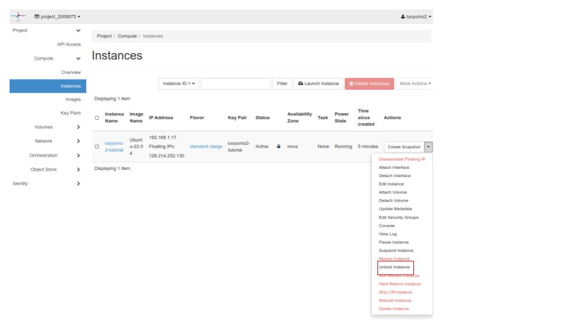
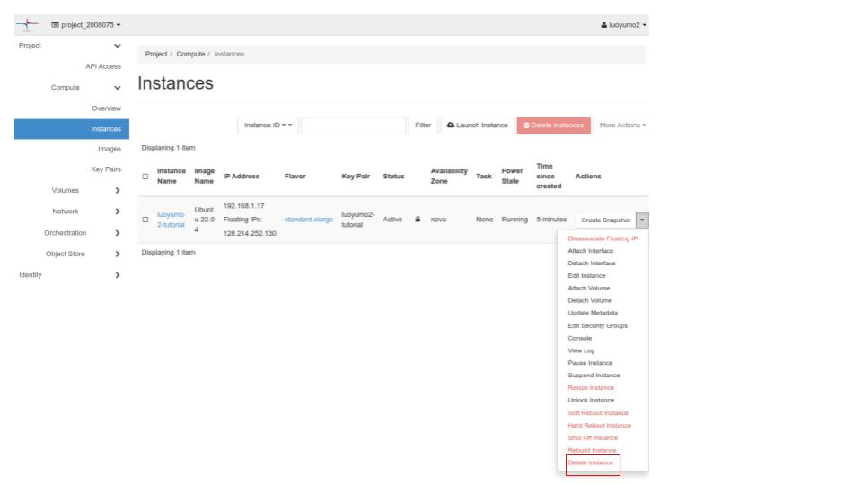

# Delete a virtual machine in cPouta
You can delete your VM from cPouta GUI or using the OpenStack CLI.

**WARNING**: The deletion is unrecoverable and normally you don't need this step. If you do want to delete your VM, please make sure you only delete **your own one**, i.e., the VM whose name starts with your CSC username. 

Using GUI: 

First unlock your VM


Then delete your VM


CLI:
```bash
openstack server unlock <your-vm-name>
openstack server delete <your-vm-name>
```